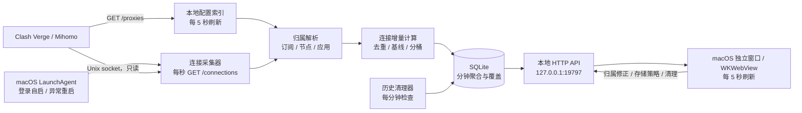
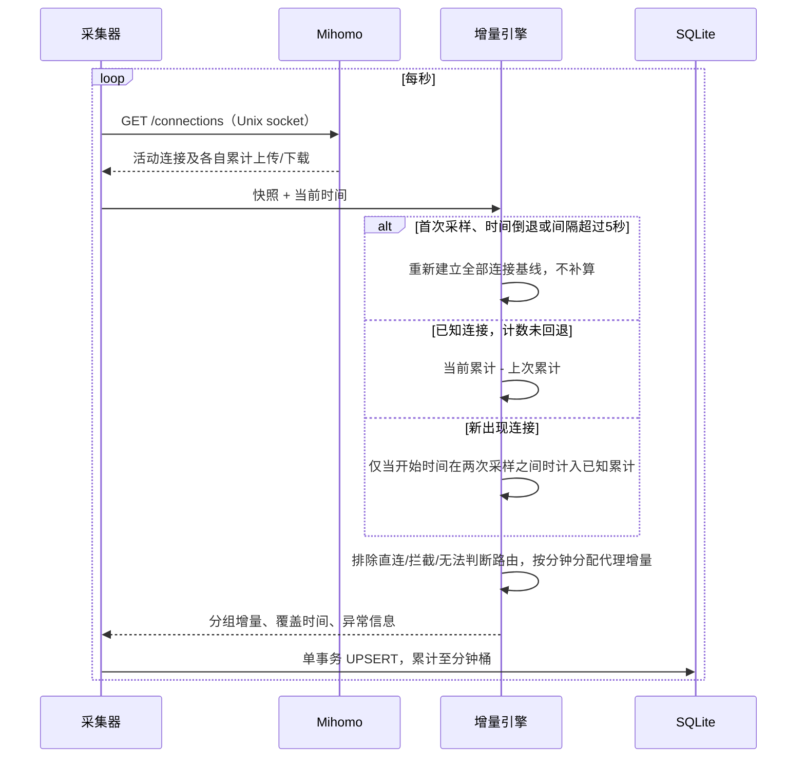
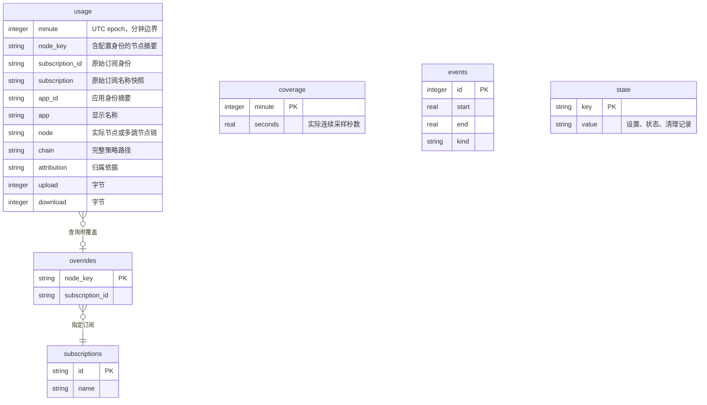
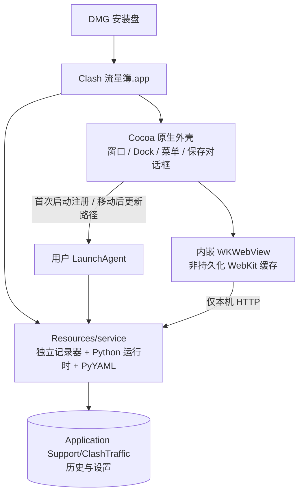

# Clash 流量簿：架构与统计口径

版本：0.2.0 · 运行环境：macOS · 时间口径：Asia/Shanghai（UTC+8）

## 1. 目标与边界

保留官方 Clash Verge Rev 安装包，提供独立的本地历史统计。只计经过真实代理节点的连接，按时间、订阅、节点和应用进行组合查询。支持自动保留策略、空间上限、手动清理和可逆的订阅归属修正。

本机已验证环境：Clash Verge Rev 2.5.2，Mihomo v1.19.29，Unix socket `/tmp/verge/verge-mihomo.sock`。不修改 Clash 配置，不开启外部 TCP 控制端口，不替换内核。

这是**活动连接快照采样器**。不具备连接关闭事件的最终计数，因此可能漏掉短连接及最后一段流量，不作为计费或审计系统。节点传输字节与机场协议开销、计费倍率也有差异。

## 2. 系统结构

代码分层：

| 模块 | 责任 |
|---|---|
| `core.py / Mihomo` | 仅允许 `/connections`、`/proxies`、`/version` 的 Unix socket GET |
| `core.py / Attribution` | 读取本地订阅清单和运行配置；识别实际节点与应用 |
| `core.py / DeltaEngine` | 连接 ID 基线、累计值差额、跨分钟分配和异常重置 |
| `storage.py / Store` | 参数化 SQL、分钟累计、查询、CSV、清理与压缩 |
| `server.py / Collector` | 单采集线程，重试、心跳与周期性维护 |
| `server.py / Handler` | 本地页面与 API；Host、Origin、CSRF 校验 |
| `static/` | 原生 HTML / CSS / JavaScript，无前端构建或第三方 CDN |
| `native/main.m` | Cocoa 窗口、Dock、菜单、原生导出、后台服务注册和生命周期 |
| `build_macos.py` | 编译原生外壳，封装 Python 运行时与后端，生成签名 `.app` |
| `manage.py` | 源码版安装、启动、停止、重启和卸载 |

选择 Python 标准库 HTTP 服务和 SQLite，是因为此工具只运行在一台 Mac、一个用户和一个采集实例下，不需要额外安装数据库、Node 服务或云端账户。后端唯一第三方运行依赖为 PyYAML 6.0.3。桌面成品通过 PyInstaller 6.22.2 将解释器和依赖一起封装，不依赖用户安装 Python。

## 3. 采集与计数算法

关键约束：

- 第一次读取已有连接时只建立基线，不把其历史累计值记到当前分钟。
- 相同连接 ID 的重复快照只有增量，无增量不写用量。快照内重复 ID 忽略。
- 连接消失时不虚构最终值。数据不足的短连接不补估。
- 已建立连接锁定首次识别的订阅、节点、应用和链路，避免切换后错记旧连接。
- 超过 5 秒没有有效连续采样、系统时钟倒退或服务重启时重建基线。宁可明确缺失，不把离线流量堆到恢复后的时段。
- 连接计数回退时重新建立该连接基线，不产生负流量。
- 单次采样跨分钟时，按各分钟占据的时间比例分配上传和下载，整数余数归末桶，字节守恒。因此分钟值是按采样区间分配，不是内核逐字节时间戳。
- 使用文件锁防止两个采集器同时写同一数据库。
- 每次有效采样事务写入；崩溃后已提交历史仍可查询。系统掉电下的持久性受 SQLite WAL/NORMAL 策略影响。

## 4. 代理与订阅识别

1. 读取连接 `chains`，结合 `/proxies` 的实际类型，过滤 Selector / URLTest / Fallback / LoadBalance / Relay 等策略组以及 Direct / Reject / Pass 等内建行为。
2. 至少有一个确认的代理节点，才纳入代理用量。未知路由仅展示当前数量，不混入代理数字。
3. 用运行配置中的服务器、端口、协议与认证身份，匹配各本地订阅内的节点身份。
4. 身份使用本机随机密钥的 HMAC 摘要。同名而不同凭据/服务器的节点得到不同身份，原始字段不入库。
5. 单跳命中当前订阅时优先使用当前订阅；否则使用唯一可确认来源。无法判断则记为“归属待确认”。
6. Provider 来源匹配只核对本地配置中的 Provider 名称和来源，不额外下载订阅。来源配置相同不保证提供商计费口径相同。
7. 多跳连接的上传下载只累计一次，不向每一跳重复分摊；跨来源多跳应视为归属待确认。
8. 手动归属保存为覆盖表，查询时生效，原始记录保留。恢复自动识别就是删除覆盖项。作用范围为该节点身份的全部历史和后续数据。

**已知限制：**配置索引每 5 秒刷新一次，切换配置附近的新连接可能被旧索引识别。Provider 动态更新、外部脚本改写、合并配置、已在采样前建立的连接，均可能影响来源判断。现有安装的普通订阅内联节点已经验证匹配；其他配置形式需要按实际使用继续验证。

## 5. 应用归并

优先使用 `metadata.processPath` 中最外层 `.app`，读取其 Info.plist 的 Bundle ID 和名称，辅助进程归入所属应用。不能归并时保留进程名；缺失进程信息时为“未知应用”。不扫描其他进程，不增加系统权限，不保存进程完整路径。不同身份但同名的应用仍可能显示相同名称。

## 6. 数据模型

`usage` 复合主键：分钟、节点身份、原始订阅 ID、应用 ID、链路、归属依据。数据库保存分钟聚合，不保存原始连接列表、连接 ID、目的域名、目的 IP、订阅 URL、节点密码或内容载荷。

保留时区无歧义的 epoch；显示与筛选统一为北京时间。手动选择的区间为 `[开始时间, 结束时间)`，精确到分钟。HTTP 的旧式仅日期参数仍按包含结束日处理，但界面始终使用日期时间。

## 7. 查询、页面与交互契约

- 默认今天；预设近 7 天、本月；自定义开始、结束日期和时分。
- 趋势提供分钟、15 分钟、小时、天。自动粒度：范围不超过 2 天按小时，否则按天。
- 查询最大 366 天；一个趋势最多 400 个时段。超出时保留上次成功结果并提示缩短范围或放大粒度，不默默改变用户选择。
- 点击柱形显示该时段的确切值与采集覆盖；“查看该时段”将范围收窄到该桶，天可下钻小时，小时可下钻分钟。
- 应用、订阅、节点排行可切换，点击排行联动全页面筛选。筛选状态写入 URL，刷新和前进/后退可恢复。
- 单个堆叠柱状图（下载绿、上传紫），一个排行面板、一个 50 行分页明细表。总量有独立标签，颜色不是唯一信息来源。
- 明细按应用/订阅/节点/链路汇总；导出 CSV 使用相同筛选范围，包含全部明细行，而非仅当前页。
- 页面每 5 秒刷新一次，选项每 30 秒更新。窗口不可见时暂停页面请求；后台采集继续。
- 采集器离线时保留历史数字，速率显示暂停，顶部状态变化。查询/API 失败保留上次成功数据并明显提示。
- 每个柱形支持键盘与可读标签，数值可点击查看。窄窗口将摘要和趋势放在前面，排行下移，明细表在自己的容器横向滚动。
- 采集覆盖是“该时段采集器连续工作的比例”，不是流量完整率。安装前、离线期和未来时段明确区分。

## 8. 存储容量与清理

默认：保留 180 天、统计数据库上限 256 MB。均可在界面更改。

- 保留天数范围 0–3650，0 表示只按容量管理。
- 大小上限 8–8192 MB，按 1024² 字节计算，范围包括 SQLite 主文件、WAL 和 SHM。
- 采集器每分钟检查，先删过期记录；超过上限时优先删除最早的分钟记录，VACUUM 回收空间，目标约为上限的 80%。
- 空间限制为**周期检查的软上限**，新写入或 VACUUM 临时文件可能短暂超过上限；并非文件系统硬配额。
- 保留设置、订阅索引和手动覆盖；用量、覆盖和对应旧事件随历史清理。程序代码/依赖不属于统计缓存。日志轮转单文件 1 MB、两份备份，总计约 3 MB。
- 支持清理全部历史，或清理精确到分钟的指定区间。操作前有独立确认对话框，明确不可恢复。区间清理不受主页面应用/订阅筛选限制。
- 自动清理可能删掉尚未导出的历史，降低空间或保留天数前页面明确提示。

## 9. 安全与运行

- 仅监听 `127.0.0.1:19797`；拒绝非本机 Host，不启用 CORS。
- 修改请求同时校验本机 Origin 与页面取得的随机 CSRF token。
- HTML 转义所有应用/节点/订阅名称；CSV 对可触发表格公式的值进行转义。
- 页面 CSP 限定资源来自本机，无第三方脚本、字体或图片请求。
- 数据目录以私有权限创建。身份密钥只用于本地 HMAC，不是 Clash 凭据。
- LaunchAgent 使用用户身份，登录自动运行；程序退出后由 launchd 重启。关闭或退出桌面窗口不影响采集。
- 日志只记录错误类别，不记录配置、密钥或连接目标。
- 这是同一用户、本机使用的 HTTP 服务，非多用户生产服务器；不应绑定到局域网或公网。

## 10. 验证与后续演进

测试覆盖基线、重复快照、新旧连接、直连排除、计数回退、中断恢复、跨日守恒、订阅切换、同名节点、应用归并、分钟范围、聚合守恒、手动覆盖、持久化、CSV 转义、保留策略及最大空间压缩。HTTP 与浏览器交互验证见 `VALIDATION.md`。

若未来需要尽可能完整的字节级归属，应为 Mihomo 增加连接关闭时的最终计数事件和持久化队列，再由此服务消费。仅替换前端为原生窗口或将页面嵌入 Clash Verge，无法消除采样遗漏。

## 11. 桌面安装包与运行时

桌面版是原生 macOS 容器配合内嵌 WebKit，不是逐控件重写为 AppKit，也不会弹出外部浏览器。这样保留已验证的查询与图表，同时提供正常 Mac 应用的打开、退出、菜单和导出体验。

- `.app` 内仅包含代码、运行时、图标和页面，不包含本机历史、订阅配置或身份密钥。
- 首次启动注册用户 LaunchAgent，指向 `.app/Contents/Resources/service/clash-traffic-service`。无需 Python/Node 环境。
- 退出 UI 不结束记录器；停止后台记录通过独立菜单执行。卸载服务会移除启动项，但保留数据库。
- UI 使用非持久化 WebKit Data Store，不额外积累浏览器磁盘缓存。
- 仅允许内嵌界面导航到固定本机地址；CSV 使用 `WKDownload` 与 `NSSavePanel`。
- 后台服务路径变化时先等待旧进程退出，再注册新路径，避免端口或数据库锁竞争。
- 安装盘内直接运行会提示先拖入应用程序，避免后台服务指向已弹出的磁盘。
- 构建目标 arm64；最低版本声明 macOS 12，但只在当前 macOS 26.6.2 实测，不能据此承诺所有旧版本兼容。
- 包含 ad-hoc 签名校验，没有 Developer ID 证书、公证或自动更新服务；面向本机使用。跨设备正式分发前需要补齐签名、公证和兼容性测试。

## 0.1.3 界面组件与文档

日期选择使用随包保存的 Flatpickr 4.6.13（MIT），无运行时 CDN。日历显示在独立模态窗口中，确认才回填北京时间字符串。存储设置分自动与手动页签，标题与操作栏固定。交互期间暂停界面轮询，后台采样照常进行。三份说明见 `docs/`，由 `build_docs.py` 生成独立 HTML，应用帮助菜单可打开本地文档。

## 0.1.4 查询视图扩展

原始 `usage` 与 `coverage` 结构不变。应用组合仅在 `_base` 查询中计算 `display_app_id` 和 `display_app`；默认 combined 对 ChatGPT、codex、ChatGPT Computer Use 做大小写不敏感的完整名称匹配，其余保留原始 ID。`app_mode=separate` 使用原始身份。筛选、排行和汇总使用同一表达式。

明细先聚合原始来源，再按显示应用、有效订阅、节点身份聚合。`detail_mode=sources` 直接返回原始来源层，`summary` 返回汇总层；分页与 CSV 使用同一查询。保留节点身份差异，不凭同名合并。源行带首末分钟与来源计数。应用组合不证明进程血缘；名称匹配和历史识别限制详见 `docs/聚合规则.md`。

`summary.daily` 独立从选中分钟和全局采集覆盖按北京时间聚合，包含范围内所有日期，最多 366 天。日历颜色阈值固定，区分零、无覆盖、部分覆盖和未来。趋势柱状图堆叠上传下载；SVG 折线分别绘制两者，在未知时段断开。

新增状态键 `preferences` 保存 chart_type、app_mode、detail_mode，接口沿用本机 Host、Origin 和 CSRF 保护。偏好不参与采集，也不改变原始数据；无数据库迁移。

## 0.2.0 前端架构替换

当前用户界面为 `frontend/` 下的 Next.js 静态导出。`src/app/layout.tsx` 持有共享 Providers 和 Shell；各路由仅挂载对应业务组件。`store.tsx` 管理筛选、偏好与 TanStack Query，`model.ts` 集中日期、分组和图表口径，`components/ui` 保留 shadcn 官方组件源码并做主题及中文适配。原有 Python/SQLite 数据链路不变。

部署链路：Next build → frontend/out → build_frontend.py → static/ui → PyInstaller → WKWebView。本地资源由 WebAssets 白名单提供，Next 内联引导脚本按内容哈希放行。前端无 Node 服务、Server Actions、远程字体或 CDN。完整架构以 `docs/系统说明.md` 的 0.2.0 章节为准。
