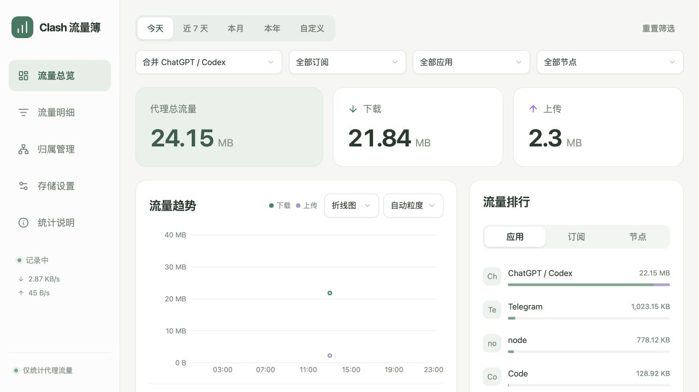

# Clash 流量簿

[](LICENSE)


Clash 流量簿是面向 Clash Verge Rev / Mihomo 的 macOS 本地代理流量统计应用。它只计算真正经过代理节点的上传和下载，按日期、时段、订阅、节点与应用保存历史，并提供日历热力图、趋势分析、来源追踪、CSV 导出和自动清理。

数据与身份密钥只保存在本机。项目不会修改 Clash Verge 配置，不保存访问域名、目标 IP、订阅地址、节点密码或原始连接，也不会把统计结果上传到云端。



## 主要功能

- 仅统计代理链中包含真实代理节点的连接，排除 `DIRECT` 与 `REJECT`。
- 按今天、近 7 天、本月、本年或自定义分钟范围查询，结束时间不包含在统计区间内。
- 月度与年度日历用颜色展示每天的代理流量，同时区分未来、无采集记录和部分覆盖。
- 趋势可切换柱状图与折线图，并从天、小时继续下钻到更细时段。
- 按应用、订阅和实际节点排行；同名节点保留稳定身份编号，代理链差异可在“来源”中核对。
- ChatGPT、Codex 与 ChatGPT Computer Use 可合并查看，也能恢复为原始应用身份；浏览器不会被误归入该组合。
- 历史保留天数和数据库空间上限可配置，也支持按时间范围手动清理。
- 原生 macOS 窗口、Dock 与菜单栏入口，后台 LaunchAgent 可在界面退出后继续记录。

## 适用范围与限制

本项目通过 Mihomo 的活动连接快照计算相邻采样间的字节差额。极短连接、连接消失前的最后一段流量、电脑休眠和采集器离线期间的数据可能遗漏；首次启动只建立基线，不补算安装前的历史。因此它适合观察本机代理流量的结构与趋势，不能替代机场账单、抓包工具或系统级审计。

当前成品面向 macOS Apple Silicon，最低声明 macOS 13.3。项目仍处于早期阶段，应用使用 ad-hoc 本地签名，尚未经过 Apple Developer ID 签名和公证。

## 文档

- [使用文档](docs/使用文档.md)：查询、筛选、清理与导出。
- [运行文档](docs/运行文档.md)：安装、备份、排障与构建。
- [系统说明](docs/系统说明.md)：架构、统计口径、接口和组件选择。
- [离线文档首页](docs/index.html)：双击可阅读；桌面应用“帮助”菜单也可打开。
- [聚合规则](docs/聚合规则.md)：重复应用、节点身份、ChatGPT / Codex 组合和日历颜色口径。
- [参与贡献](CONTRIBUTING.md)：开发环境、测试要求与安全报告方式。

## 安装与打开桌面版

如 [Releases](https://github.com/ZhangNoName/clash-traffic/releases) 中提供 `Clash-Traffic-0.2.0-arm64.dmg`，打开后将 **Clash 流量簿.app** 拖到 Applications，再从“应用程序”启动。仓库未发布对应安装包时，请按下方“从源码构建安装包”生成本机版本。

桌面版包含原生 macOS 窗口、Dock 图标、应用菜单和 CSV 保存对话框。界面使用内嵌 WebKit 渲染，不需要打开浏览器。记录器和 Python 运行时已经封装进应用，使用时无需安装 Python、Node 或其他依赖。

首次启动自动建立用户后台记录服务。关闭窗口保留菜单栏图标；⌘Q 退出图标和界面，后台仍继续记录；菜单“记录服务”可启动、停止本次记录、打开数据目录或卸载后台服务。

当前安装包为 **Apple Silicon / arm64**，已在本机 macOS 26.6.2 验证。使用 ad-hoc 本地签名，尚未使用 Apple Developer ID 签名和公证；未验证其他电脑或系统版本。

主界面默认显示今天。点击“自定义”，选择开始与结束日期时间后点“应用范围”。结束时刻不含在区间内，例如 09:00–12:00 只统计上午这 3 小时。可选择分钟、15 分钟、小时、天；过细粒度超过 400 个时段时，请缩短范围或选择更大的粒度。

点击排行筛选应用、订阅或节点。点击趋势柱形可查看该时段数值，再点“查看该时段”继续细分。明细“来源”弹窗中的“修改订阅归属”可修正节点归属，恢复自动识别会撤销手动覆盖。

**存储设置**中可以设置保留天数（默认 180 天）、最大统计空间（默认 256 MB），切换“手动清理”可清理指定时段或全部历史。清理无法恢复。最大空间包括数据库与 WAL/SHM，不含程序与依赖；按分钟检查，可能短暂超限。日志另限约 3 MB。

## 桌面版服务管理

- `⌘,`：打开存储设置。
- `⌘E`：导出当前筛选结果，显示 macOS 保存对话框。
- `⌘R`：刷新界面。
- `⌘Q`：退出界面，后台继续记录。
- 菜单“记录服务 → 停止本次后台记录”：停止采集；下次登录或打开应用可恢复。
- 菜单“记录服务 → 卸载后台服务（保留历史）”：移除启动项并退出，保留统计历史；下次打开应用会重新安装服务。完全移除时先执行此项，再把应用移到废纸篓。

升级应用前先停止后台记录并退出界面，再替换 `.app`。应用移动位置后重新打开，会更新后台服务路径。

`manage.py` 和 `.command` 脚本保留为源码开发入口；普通使用以 `.dmg` / `.app` 为准。

## 文件位置

| 内容 | 位置 |
|---|---|
| 数据、设置和日志 | `~/Library/Application Support/ClashTraffic/` |
| 数据库 | `traffic.sqlite3`（同目录还可能有 WAL/SHM） |
| 节点身份密钥 | `identity.key` |
| 桌面版代码与服务 | `.app/Contents/MacOS` 与 `.app/Contents/Resources/service/` |
| 桌面版 Python 运行时 | 已包含在 `.app/Contents/Resources/service/` |
| 登录自启配置 | `~/Library/LaunchAgents/local.clash-traffic.collector.plist` |
| 应用入口 | `~/Applications/Clash 流量簿.app` |

备份前从菜单停止后台记录，复制数据库、`identity.key` 到自己的备份位置，再启动记录。密钥丢失不会影响历史查询，但会让后续节点/应用身份重新生成。

## 统计口径

- 只记录通过真实代理节点的连接，排除 DIRECT 和 REJECT；不是全机网卡流量。
- 应用以系统返回的进程路径归并；信息缺失时显示未知应用。
- 普通订阅通过节点配置身份匹配；无法确认来源的保留未知归属，可手动修正。
- 使用每秒活动连接快照；短连接和连接末尾可能遗漏，数字不是机场账单。
- 首次启动、超过 5 秒的采集中断或服务重启时仅重新建立基线，不补算未知历史。
- 多跳连接只计一次，不表示各跳机场分别扣费的用量。
- 统计历史只能从采集开始积累。界面中的采集覆盖不是流量完整率。
- KB/MB/GB 按 1024 进制显示；CSV 导出精确字节数。

## 开发与测试

```sh
python3 -m venv .venv
.venv/bin/python -m pip install -r requirements.txt
.venv/bin/python -m unittest discover -s tests -v

cd frontend
npm ci
npm run test
npm run check
cd ..

.venv/bin/python build_frontend.py
.venv/bin/python -m clash_traffic.server --data-dir ./preview-data --port 19799
```

端口、Clash 数据目录和 Unix socket 可通过 `--port`、`--verge-dir`、`--socket` 覆盖。开发数据应使用独立目录，避免与正式采集器同时访问同一个数据库。0.2.0 前端使用 Next.js 静态导出；先在 `frontend/` 执行 `npm ci`、`npm run test` 和 `npm run check`，再从项目根目录运行 `python3 build_frontend.py`。后端变更需要重启服务。

详细架构、数据模型、接口边界与清理策略见 [ARCHITECTURE.md](ARCHITECTURE.md)。

## 从源码构建安装包

在 macOS arm64 上安装编译工具和构建依赖，构建时需要 Python，但成品应用不需要：

```sh
python3 -m venv /tmp/clash-traffic-build-env
/tmp/clash-traffic-build-env/bin/pip install -r requirements-build.txt
/tmp/clash-traffic-build-env/bin/python build_docs.py
/tmp/clash-traffic-build-env/bin/python build_macos.py --work-dir /tmp/clash-traffic-build --output /tmp/clash-traffic-release
```

构建包含 Objective-C / Cocoa / WKWebView 应用外壳和 PyInstaller 打包的记录器。`build_macos.py` 生成 `.app`；将其与指向 `/Applications` 的链接置于 staging 目录，再用 `hdiutil create -srcfolder ... -format UDZO` 生成 DMG。打包流程参考 [PyInstaller 官方文档](https://pyinstaller.org/en/stable/usage.html)。

本机 HTTP 地址 `http://127.0.0.1:19797` 仍可用于调试，日常使用无需打开它。


## 0.2.0 前端重构

Next.js 16 + React 19 + TypeScript + shadcn/ui + Tailwind CSS 4；TanStack Query 管理缓存，Recharts 绘制趋势。路由页面共用侧栏和状态，统计筛选保持在 URL。Next 采用静态导出，由原有 Python 本机服务提供页面，成品无需 Node.js。

前端代码位于 `frontend/`；执行 `npm ci`、`npm run test`、`npm run check` 后，从项目根目录运行 `python3 build_frontend.py`。完整开发与打包方法见 [运行文档](docs/运行文档.md)。构建产物为 `clash_traffic/static/ui/`，新增 HTTP 路由和 CSP 脚本哈希在 `clash_traffic/web_assets.py`。

最低系统声明为 macOS 13.3（Apple Silicon），已在本机 macOS 26.6.2 验证构建。应用使用本地 ad-hoc 签名。所有应用聚合、日期范围、存储清理和后台采样算法继续沿用，历史数据库不迁移。

## 开源协议

项目自身源码采用 [MIT License](LICENSE)。打包应用中包含的 Python、PyYAML、Next.js、React、Radix UI、Recharts 等第三方组件继续遵循各自协议；完整归属与协议文本见 [THIRD_PARTY_NOTICES.md](THIRD_PARTY_NOTICES.md) 和 [FRONTEND_LICENSES.txt](FRONTEND_LICENSES.txt)。项目名称中提及的 Clash、Clash Verge Rev、Mihomo、ChatGPT 和 Codex 均归各自权利人所有，本项目与这些项目或厂商没有官方隶属关系。
